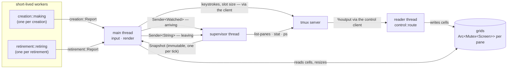

# Concurrency and thread safety

The app runs four kinds of thread and five channels, and shares almost
nothing between threads. The module docs in `src/supervisor.rs` and
`src/control.rs` cover their own parts; this page shows the whole model.

## The threads

- **Main** (`src/app.rs`, `app::run`) — the terminal, the keyboard, the
  render loop. Polls for a keystroke for 16 ms (`FRAME`) and draws a frame
  either way.
- **One reader** (`control::route`, spawned in `Client::attach` in
  `src/control.rs`) — blocks reading the control client, decodes `%output`
  notifications, and writes the bytes into the owning pane's grid. One
  reader serves every spawn.
- **One supervisor** (spawned in `supervisor::watch`, `src/supervisor.rs`) —
  ticks every 200 ms, builds an immutable snapshot of every spawn's status,
  and sends it over a channel
  ([knowing what a spawn is doing](knowing-what-a-spawn-is-doing.md)).
- **Short-lived workers** — one thread per creation (`creation::making` in
  `src/creation.rs`: the git half, seconds of `git worktree add`) and one per
  retirement (`retirement::retiring` in `src/retirement.rs`: stop, check,
  remove). Each reports over a channel and ends.

There is no task per spawn. tmux owns the children, so twenty spawns are
twenty rows and twenty grids, served by one reader and one supervisor.

## Blocking, not async

There is no async runtime. Async pays off with hundreds of simultaneous
waits; this app has one stream for all spawns, one subprocess, and twenty
stats five times a second. Blocking calls on named threads cover that.

## What crosses each channel

All are `std::sync::mpsc`. Everything sent is moved whole, never shared:

- **`Watching.snapshots`** (`Receiver<Snapshot>`) — supervisor to main. One
  immutable `Snapshot` per tick. The frame loop drains to the latest, so the
  user sees the current state.
- **`Watching.arriving`** (`Sender<Watched>`) — main to supervisor: a spawn
  made while the app runs, taken up at the next tick.
- **`Watching.leaving`** (`Sender<String>`) — main to supervisor: a retired
  spawn's name, dropped from watching before anything is asked about it.
- **`reports`** (`Sender<creation::Report>`, made in `app::run`) — creation
  worker to main: `Said::Doing`/`Made`/`Refused`. Drained fully, not
  sampled, because every line records something about to happen on disk
  ([drafts and creation](drafts-and-creation.md)).
- **`retirements`** (`Sender<retirement::Report>`, made in `app::run`) —
  retirement worker to main. Drained fully for the same reason
  ([retirement](retirement.md)).

A sixth channel, `Sender<Attaching>` in `Client::attach`, exists only for the
attach handshake: the reader tells the attaching caller whether tmux accepted
the client.

## What is shared, and who owns what

Shared, behind locks (`src/control.rs`):

- **`Grid = Arc<Mutex<Screen>>`** — one per pane. The reader writes it; main
  reads and resizes it.
- **The routing map** (`Grids`, an `Arc<Mutex<HashMap<String, Grid>>>`) —
  written by main (`Client::watch` / `Client::forget`), read by the reader.
  The reader releases the map before locking a grid, so a slow frame drawn
  from one spawn's grid never delays another spawn's output.
- **`Client.saying`** (`Arc<Mutex<Box<dyn Write + Send>>>`) — the writer to
  the control client.
- **`Ended`** (`Arc<OnceLock<String>>`) — why the reader stopped. Set once
  by the reader, checked by main every frame (`Client::listening`), because
  a hung-up client leaves grids that have merely stopped changing.

A poisoned lock means another thread panicked. The app stops with one
message, `POISONED`, instead of drawing a broken screen.

Owned and never shared: the supervisor's watched list, its record mtime
cache (`Records`), its probe cache (`Probes`), and its last snapshot; main's
`Held` (spawns, drafts, cursor, retirements) and the latest snapshot it
rendered.

## Two transports to tmux

- **The control client** carries every pane's output to the app; the app
  sends back keystrokes (`send-keys -H`) and the slot's size
  (`refresh-client -C`).
- **Everything else** — open a window, start the harness, `list-panes`, kill
  a pane — runs as a per-command `tmux` call, because control mode cannot
  report a process dying. See [the tmux session](the-tmux-session.md).

## The single-reader risk

One thread decodes everything every spawn draws. That is a serialisation
point with no backpressure mechanism: if decoding fell behind, output would
back up in the control client's pipe and every spawn would lag at once, not
just the visible one.

Measured, per [scale at twenty](../../evidence/scale-at-twenty.md): driven
at twenty spawns each redrawing a whole alternate screen five times a
second, the reader kept up. The screen was never more than one of a spawn's
own repaints behind (worst lag 171 ms, inside one repaint interval, and not
growing), and switching mid-turn took 1.2 ms median. Two limits keep that
finding bounded rather than closed:

- What drew was the stand-in at a fixed cadence, not twenty real agents.
  Bursts, wide characters, and sub-agent output remain unmeasured.
- The lag was read off the spawn in the slot; the other nineteen were load
  on the reader, not samples of it.

So the risk is bounded, not closed. If the reader ever lags, the available
moves are ordinary and none changes the design:

- decode off the read thread;
- one emulator per thread;
- drop frames for spawns that are not on screen.

## What quitting does to all of this

Quitting kills nothing. Dropping the `Client` hangs up the reader. The
snapshot receiver going away ends the supervisor's loop. A running worker
continues until the process ends, which can leave litter the app accepts and
reports ([starting and leaving](starting-and-leaving.md)). The tmux server
and every spawn in it were never the app's to take down.

Vocabulary as defined in [the glossary](../glossary.md).
