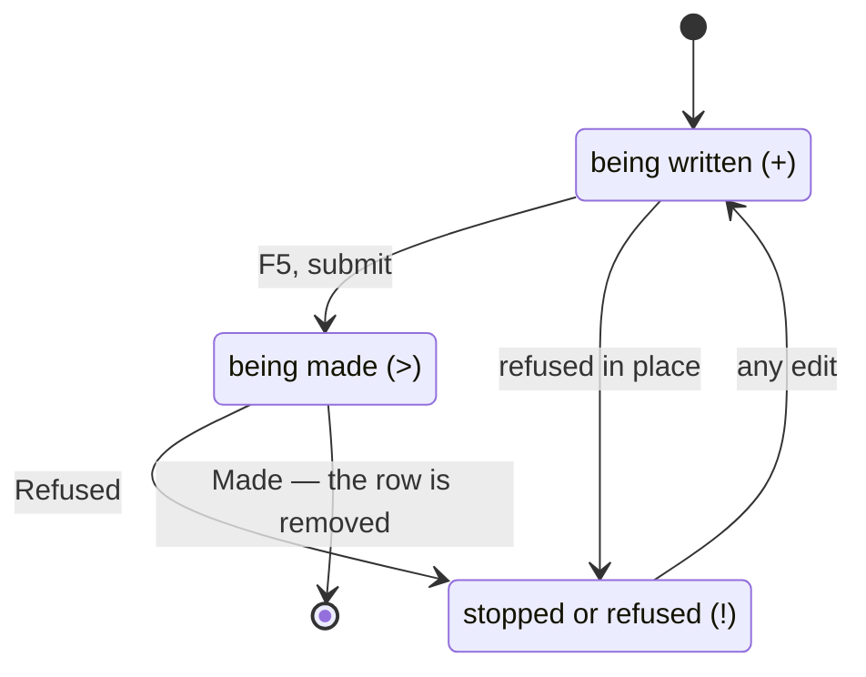

# Drafts and creation

The path from typing a description to a running harness. `src/draft.rs` owns
the form, the record, and the discard question. `src/creation.rs` owns the
making. Naming lives in `src/names.rs`, the command-line entry in
`src/cli.rs`. `src/app.rs` handles a finished creation's arrival.

## What a draft is

- **State in the app, nothing else.** No pane, no process, nothing on disk —
  a record in a `Vec` (`Drafts` in `src/draft.rs`). Several at once
  therefore cost nothing.
- **A first-class row**, pinned above the repositories. Selected, it takes
  the slot as a form. Unselected, it shows the first line of its work, or
  "a new spawn" until there is one.
- **Not a modal.** The user can leave for a stopped spawn and come back:
  text, caret, and focused control are as left. The list never disappears;
  the whole product rests on that rule.
- Identified by a count, not a name (`draft::Id`), never reissued — not even
  to a draft replacing a discarded one.

## The form

```
NEW SPAWN

▍Repository

 Work

 Colour
    Red
  › Blue

Tab moves between fields
F5 starts it
F3 discards it — it asks first
F6 / F7 leave it — nothing is lost
```

- Two text fields — Repository (one line) and Work (a paragraph) — plus one
  choice list per `Choices` the harness seam offers. The lists are fetched
  once at start-up and shared by every draft.
- **The form only presents lists of options.** It receives titles and
  labels, never learns what a choice means, and returns ids it never reads.
  An empty list means the control **does not exist**: `Draft::new` drops it
  rather than drawing it empty, so a harness offering no such choice is
  ordinary, not a special case ([the harness seam](the-harness-seam.md)).
- Navigation: `Tab` / `Shift-Tab` cycle the controls, wrapping; `↑` / `↓`
  move within a choice list, stopping at the ends. `Enter` is a line break
  in Work (a paragraph) but *done with this control* in Repository (a path
  has no lines) and in a choice list. The caret appears only where the
  keyboard can type.
- Marks and the gutter come from [the screen](the-screen.md)'s scaffolding.

## Two ways to `Wanted`

Both entry points produce a `creation::Wanted`: a repository path, the work
in the user's own words, and the picked ids. Everything after that is shared
code, so a spawn from a form and one from an argument list are the same
spawn.

- **The command line** (`src/cli.rs`): `harness-launcher <repo> <work>
  [--model <id>] [--level <id>]`; several at once separated by `--and`, each
  group with its own choices. Unstated choices fall back to the harness's
  defaults. An unquoted description is refused rather than half-read.
- **The form**: `F5` calls `Drafts::submit`. A draft missing its repository
  or its work refuses **in place**: the reason appears under the form, every
  character intact. A draft already being made is not started twice.

Before anything is created, `creation::harness_installed` refuses if the
harness's program is not on the `PATH`: no worktree, no branch, no litter —
the refusal costs one sentence.

## The creation pipeline

```mermaid
sequenceDiagram
    participant M as main thread (src/app.rs)
    participant W as worker thread (creation::making)
    participant T as tmux server
    M->>W: Wanted + draft::Id
    W-->>M: Doing: "reading &lt;repo&gt; and resolving the branch to start from"
    W->>W: plan(): open repo, default branch, name, recipe
    W-->>M: Doing: "creating the worktree &lt;path&gt; on &lt;branch&gt;"
    W->>W: git worktree add --no-track -b &lt;branch&gt;
    W-->>M: Made(Plan)
    M-->>M: Doing: "starting the harness in &lt;worktree&gt;"
    M->>T: open window (holder), grid behind the pane
    M->>T: start the harness (respawn-pane, the seam's recipe)
    M->>M: adopt: supervisor told, row arrives, draft row removed
```

In order, with owners:

1. **Resolve** (worker): open the repository (any directory inside one
   works) and resolve the default branch to start from. `creation::plan`.
2. **Name** (worker): a slug of the work plus a random suffix
   (`src/names.rs`); the branch is `spawn/<name>`. See
   [worktrees and branches](worktrees-and-branches.md).
3. **Create the worktree** (worker): on a fresh branch, under the app-owned
   root. `Plan::create`, via `git::add_worktree`.
4. **Open the window** (main): a pane created with the holder, the grid put
   behind it *before* the harness starts, so no first frame is missed
   ([the tmux session](the-tmux-session.md)).
5. **Start the harness** (main): `respawn-pane` with the recipe the seam
   translated from the spec. `creation::start`.
6. **Arrive** (main, `Held::adopt` in `src/app.rs`): the supervisor is told
   first; the spawn joins the list under its repository; the selection
   follows only if still on the draft. The draft's row goes last: until
   then it is the only record of where the spawn came from.

**Why the split falls there.** The first half is git: seconds of work and
nearly every refusal, so it runs on its own thread (`creation::making`)
while the app keeps drawing at sixty frames. The second half is tmux and the
control client, owned by one thread, and fast: two commands to a running
server ([concurrency](concurrency.md)). The whole path is traced in
[from keypress to running harness](../scenarios/from-keypress-to-running-harness.md).

## Intent before action

Every progress line is sent **before** its step, never after it succeeded.
The worktree line matters most: it names a path and branch that do not exist
yet, so if the thread dies the disk state is already recorded. A creation
that dies halfway leaves a record, not a mystery. See
[a creation that fails halfway](../scenarios/a-creation-that-fails-halfway.md).

## Failure, and the three marks

On refusal the row becomes a draft again, every character intact, the reason
in amber under a `NOT STARTED` heading. Cheap retry makes *refuse rather
than guess* affordable. A harness that fails to *start* leaves the worktree
and branch behind, because retiring acts on a spawn and there is none. They
are written down, never invisible.

The three states are three variants of one `Progress` field, so a flag and a
list can never disagree. Each has a one-character mark in the gutter:



While a draft is being made, the form ignores the keyboard: the text is
submitted, and a character typed now would change the screen and nothing
else.

## Concurrent creations

- **No lock.** Names carry a random suffix, so two creations never ask for
  the same path.
- Branches are created with `--no-track` (`src/git.rs`), so nothing touches
  the repository's config — the one thing concurrent `git worktree add`
  calls actually fought over.
- Naming details: [worktrees and branches](worktrees-and-branches.md).

## Discarding a draft

`F3` is the one place in the app that asks a question: the draft's words
exist nowhere else, and there is nothing to refuse over — no teardown, no
ordering, no cleanliness check. Deliberately not [retirement](retirement.md).

- **The first press is the question; any other key answers *no*** and is
  spent on the answer, never also landing in the text. One key means *yes*;
  a second key for *no* would be a second thing to learn about the app's
  only question.
- **The one refusal**: a draft a spawn is being made from. The creation
  cannot be called back, and the row is the only record of what it has made.
  It is discardable again the moment the creation stops. See
  [a draft discarded mid-creation](../scenarios/a-draft-discarded-mid-creation.md).
- **Discarding after a failed creation is allowed and announced.** The
  question says the recorded worktree and branch stay put; they are next
  mentioned when the app starts and reports what it found
  ([starting and leaving](starting-and-leaving.md)). Litter is accepted;
  invisible litter is not.

Vocabulary as defined in [the glossary](../glossary.md).
