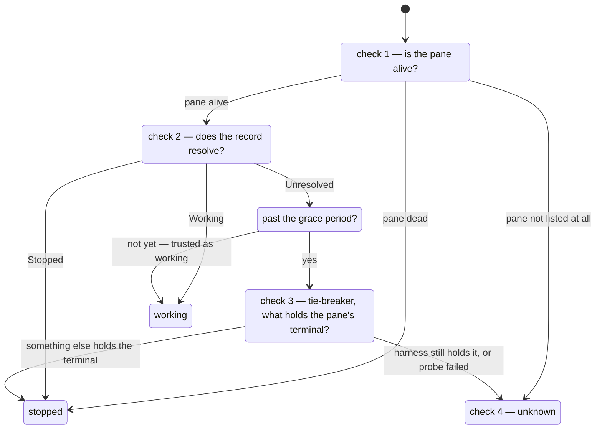

# Knowing what a spawn is doing

How the list comes to say `working`, `stopped` or `?` beside every spawn. Two
files own it. `src/snapshot.rs` holds the status ladder: a pure function over
what the app read, and the most tested seam in the app. `src/supervisor.rs` is
the thread that does the reading, once per tick.
[The harness seam](the-harness-seam.md) (`src/harness/mod.rs`) translates what
the harness's record means. [The screen](the-screen.md) draws the result.

## The three statuses

`Status` in `src/snapshot.rs` has exactly three values. The first two describe
the agent; the third describes the app:

- **working** — the agent is busy.
- **stopped** — the agent has stopped: finished, waiting on an answer, or
  dead. The app never infers which. The response to all three is the same: go
  and look.
- **unknown** — the app cannot tell. Not a kind of stopped: stopped means go
  to the spawn, unknown means the tooling is broken. Prose and screen say
  **unaccounted for** (`Status::named`).

There is no fourth status. "Creating" is a draft's state
([drafts and creation](drafts-and-creation.md)); "being retired" a
retirement's ([retirement](retirement.md)). Both draw on their own rows.

## The ladder

The ladder's four checks run in order, once per spawn per tick (`climb` in
`src/snapshot.rs`):

Three rules carry the design:

- **Check 1 acts alone.** A pane tmux kept after its process died
  (`remain-on-exit`) is **stopped** at once. This signal cannot go stale, so
  it outranks a stale record. A pane missing entirely is **unknown**, with no
  grace period: tmux knows its own panes immediately, so the app's handle must
  be wrong. See [a dead pane](../scenarios/a-dead-pane.md).
- **The grace period gates checks 3 and 4** (`GRACE`, eight seconds from
  `Watched::watching_since`; `past_grace` is the one shared answer). Inside
  it, an unresolved spawn is reported as *working* on trust, and no probe
  runs, so *still starting* cannot become *stopped* or *unknown*. Without the
  grace period, every new spawn would spend its first seconds showing the one
  status meant to signal a real problem. **A spawn adopted from an earlier run
  has no grace period** (`Watched::already_running`): it wrote its record long
  before this run, so trusting it as *working* would hide a spawn waiting for
  the user.
- **The tie-breaker can only change the answer to stopped, never to working.**
  It asks what holds the pane's terminal (`ps`, read by `holding` in
  `src/supervisor.rs`; `harness::names_the_harness` recognises the harness). A
  process holding a terminal is not an agent with something to do, so the
  probe can say *stopped* but never *working*. A failed probe must not read as
  the agent being gone: the ladder falls through to **unknown**, carrying both
  failures. The tie-breaker is not a fourth status; it is check 3 avoiding
  `unknown` when the pane has demonstrably moved on.

## The age of a status

Every row carries an age, which the list draws against its right edge. It is
the age of the **status**, not of the spawn.

The age answers "how long has this spawn been stopped". That is the question
that decides where to go next. A spawn started three hours ago and stopped a
minute ago shows `1m`.

`aged` in `src/snapshot.rs` works it out, from the two things `build` is
already handed:

- The status is the same as the last snapshot's: the moment it changed is
  carried forward from that snapshot's row (`Row::changed`).
- The status is not the same: it changed at `at`, this tick's moment.
- The last snapshot did not hold the spawn at all: it dates from
  `Watched::watching_since`, the moment the app started watching it.

`Row::age` is then `at` minus that moment. Neither the snapshot nor the list
reads a clock of its own: `build` is given the moment, and the list is given
the age.

**A spawn adopted from an earlier run has no age.** It has no
`watching_since`, because the app was not there when the status began. A spawn
running for three hours would otherwise show `0m`. `Row::age` is `None` and
the row keeps the whole width for its name, the way a spawn the app has heard
nothing about does. The first status change the app sees starts the age, and
from there the spawn ages like any other.

## What a tick reads, and what it costs

The supervisor thread ticks every 200 ms (`TICK` in `src/supervisor.rs`). One
tick:

1. Takes up new spawns and lets go of spawns retired since last tick.
2. Runs **one `tmux list-panes -a`** covering every spawn — the only per-tick
   subprocess, regardless of spawn count.
3. Stats each live spawn's record, and opens and reads the file **only when
   its mtime has moved** (`Records::of`). A record that will not resolve is
   cached like one that will, so an unreadable spawn is not re-read five times
   a second.
4. Runs **the `ps` probe as tie-breaker only**: for a spawn whose record is
   unresolved and which is past its grace period. The answer stands for five
   seconds (`AN_ANSWER_LASTS`, in `Probes`), keyed to the process it was
   about. The probe condition depends on the spawn, not on the last tick's
   conclusion, so an answer cannot turn the question off and make a row
   flicker.
5. Hands it all to the pure `snapshot::build` and sends the **snapshot** —
   built whole, immutable — down the channel. The list renders
   the latest one received; the frame loop drains the rest
   ([concurrency](concurrency.md)).

Measured at twenty spawns: a tick runs 3.8–5.4 ms against the 200 ms between
ticks, and copying the snapshot costs 2.6 µs. See
[scale at twenty](../../evidence/scale-at-twenty.md), §2.

## Output is not a status signal

The app sees every byte a spawn draws and reads none of it for status. A busy
agent and one waiting on a question both draw. Telling them apart would mean
pattern-matching one harness's screen output, which is exactly what
[the harness seam](the-harness-seam.md) exists to prevent. The ladder polls
instead.

## The record, and the seam

- Where the record lives and what its words mean are harness facts. The app is
  handed a path (`StatusFiles::of`, keyed by the pane's process id) and does
  the reading itself; the seam performs no I/O. It receives back
  `Reading::Working`, `Reading::Stopped` or `Reading::Unresolved(why)`, and
  never sees `busy`, `idle`, `waiting` or `shell`.
- The record is an **undocumented, version-gated internal of the harness** and
  is treated as fallible everywhere. A missing directory, a missing file, or a
  record that will not parse is a check that did not answer — never a refusal,
  never a status of its own.
- A record left behind by a session that has gone is not believed. The record
  names the process it belongs to, and `harness::read_status` checks that
  against the process it was looked up by.

## The deliberate bias

Where the app must guess, it errs toward showing a problem. A false *stopped*
costs a glance: the user opens the spawn, sees it working, and was going there
anyway. A false *working* costs the product: a spawn waits for the user and
never appears in the set that needs them. This is why the tie-breaker never
says working, and why the grace period is bounded on both sides: it lasts
seconds, and a spawn handed work seconds ago cannot yet be waiting on an
answer.

## What "unaccounted" shows the user

- **On the row**: the `?` mark in the gutter, nothing else. A row is one line,
  spent on the spawn's name.
- **In the slot's band**, once selected: the whole account
  (`Unaccounted::explained`), sentence by sentence — that the app cannot tell,
  the pane and process whose status would not resolve, what went wrong, and
  the last status the app actually read. When tmux no longer lists the pane,
  no process is named: that would invent a fact about a pane just admitted
  invisible. The last-read status carries across every tick that could not
  read (`Row::last_known`); the grace period's *working* is never quoted back
  as one, because it was trust, not a reading.

The reader of that band is diagnosing the app, not the agent. The walk-through
is [an unaccounted spawn](../scenarios/an-unaccounted-spawn.md); the band
belongs to [the screen](the-screen.md).

Vocabulary as defined in [the glossary](../glossary.md).
