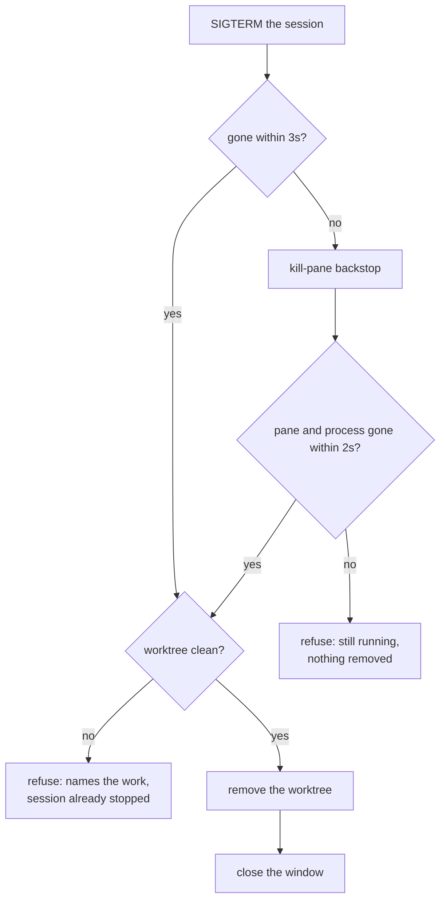

# Retirement

Stopping a spawn, and the dirty rule that can refuse. One file owns it:
`src/retirement.rs` holds the strict order, the bounded waits, the refusal,
and the record the app draws from. The dirty check is `git::uncommitted` in
`src/git.rs`; the key that requests it all is `F9` in `src/app.rs`.

## Explicit, never inferred

- A retirement is a person's request about a spawn they are done with. An
  agent falling silent is not one: the app cannot tell a finished turn from a
  question waiting for an answer, and a worktree removed on that guess could
  be an hour of somebody's work.
- Retirement is **the only act that releases what the app made**. Quitting
  kills nothing ([starting and leaving](starting-and-leaving.md)); a stopped
  agent keeps its row; only `F9` on a spawn takes anything down.
- A retirement runs on its own thread, like a creation. Stopping takes as long
  as the session takes to stop, and the app keeps drawing every other spawn
  meanwhile ([concurrency](concurrency.md)).

## The strict order

1. **Stop the process.** Send `SIGTERM` to the pid the pane runs. That signal
   means *finish and go*, so a harness can put down what it was holding.
2. **Bounded wait.** Up to three seconds (`PATIENCE`), checked every 25 ms.
   tmux decides, never the return value of `kill`: a pane tmux reports dead
   is a process it has reaped, and a signal that failed because the process
   was already gone counts as success, not refusal.
3. **Kill the pane if needed.** `kill-pane` is the backstop, with a short
   second wait (`CLOSING`). Without it, a session ignoring signals would hang
   the retirement forever.
4. **Confirm the process is gone.** After the backstop no pane is left to ask,
   so here, and only here, the process is asked directly (`kill -0`). Only
   here, because a pid is a name the system hands out again. A session that
   survives even the kill is a refusal: nothing is removed.
5. **Check the worktree is clean** — the dirty rule below.
6. **Remove the worktree.** `git::remove_worktree` runs git's own removal
   without `--force`. The app's check is the stricter of the two; git's is a
   second check covering the seconds in between.

The window closes last, after the worktree is gone. Until then, the pane is
what a refusal leaves the user looking at.



The order matters. A cleanliness check run against a live agent is a race, and
losing that race deletes work: the agent writes a file between the check
passing and the directory going. The check only means anything because the
process is already stopped. The test that pins the order uses a session that
writes a file while it is being stopped.

## The dirty rule

- Dirty is exactly:

  ```
  git status --porcelain --untracked-files=all --ignore-submodules=none
  ```

- **The flags are explicit on purpose.** git's own `worktree remove` runs this
  status without `-u`, so it honours the user's `status.showUntrackedFiles`.
  With that set to `no` — a real setting on large repositories — git's check
  misses untracked files and deletes an agent's never-staged work.
  `--ignore-submodules=none` guards against `diff.ignoreSubmodules` the same
  way. A user setting must not decide what the app may delete.
- **A dirty worktree refuses, with no confirmation flow.** Clean it up and
  press `F9` again. A refused retirement can be requested again; one under way
  cannot be started twice.
- **The refusal comes after the kill.** Accepted cost: a spawn that turns out
  to be dirty ends up stopped and must be dealt with by hand.
- The refusal names up to three of the files in the worktree, and how many
  more there are — enough to recognise the work by.

What counts, and what does not:

- **Ignored files do not count** and are removed with the worktree; a spawn's
  `.env` goes with it. If they counted, no worktree in a project that builds
  would ever be retirable.
- **Stashes do not count, and that is safe.** A stash made in a worktree lives
  in the repository's stash list and survives the worktree's removal.
- **Known blind spot**: a file marked `--assume-unchanged` never appears in
  status, so no check built on status can see it.
- git refuses outright to remove a worktree containing submodules. A spawn on
  such a repository stops but cannot be retired by the app. Removing it by
  hand is a `git worktree remove --force` the user takes responsibility for.

## What the user sees

- Each progress line prints **before** its step is attempted, so a retirement
  that dies halfway has already said what it was doing.
- The reports land in `Retirements`, held by the app rather than the thread,
  because they draw on the spawn's row: `-` in the gutter while being retired,
  `!` on refusal, and the sentence in the slot's band when selected
  ([the screen](the-screen.md)). The walk-through is
  [a retirement that refuses](../scenarios/a-retirement-that-refuses.md).
- A retirement still running when the app exits continues until the process
  ends. That can leave a session stopped and a worktree still there — litter
  of exactly the kind the design accepts
  ([starting and leaving](starting-and-leaving.md)).

## What goes, and what stays

- The worktree goes; **the branch stays**. The worktree is the app's to remove
  because the app made it. The branch holds committed work, and deleting it is
  a different, riskier act. See
  [worktrees and branches](worktrees-and-branches.md).
- Retiring is not discarding. A draft owns no session, no worktree, no branch:
  nothing outside the app to tell, nothing to take down in order
  ([drafts and creation](drafts-and-creation.md)).

Vocabulary as defined in [the glossary](../glossary.md).
