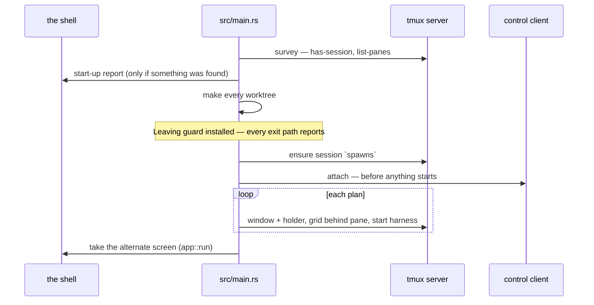

# Starting and leaving

How a run begins, in what order, and what it reports at exit. The whole path
is `src/main.rs`; the command line is `src/cli.rs`; the survey and the two
reports are `src/litter.rs`. Litter is documented here:
[worktrees-and-branches.md](worktrees-and-branches.md) points back at this
document rather than repeating it. Vocabulary is the
[glossary](../glossary.md)'s.

## The three invocations

`cli::parse` reads the arguments and returns one of three invocations:

- **Bare** — `harness-launcher` with no arguments. Not a mistake: the app
  opens with nothing running and a draft in the slot. Everything the command
  line can say can also be entered in the form. See
  [drafts-and-creation.md](drafts-and-creation.md).
- **Spawns** — one group per spawn, groups separated by `--and`. Each group is
  a repository, a quoted description, and its own `--model`/`--level`. The
  separator exists so an unquoted description is refused rather than guessed
  at as a second spawn. A half-written group (`repository` and nothing else)
  is refused, never silently treated as bare.
- **`--help`** (or `-h`, in any group) — `cli::usage()`. The model and effort
  lists in the help text come from the harness seam (`harness::models()`,
  `harness::effort_levels()`), so the text cannot drift from what the app
  accepts. Only the sentence shapes are hardcoded.

Flag-by-flag detail is in the users' reference: [../../users/](../../users/)
and [../../../CHEATSHEET.md](../../../CHEATSHEET.md).

## The start-up order

Both spawning invocations run the same function, `spawn` in `src/main.rs`;
bare is `spawn(&[])`. The order, as the code has it:

1. **Check the harness is installed** — only when there is something to start.
   An app asked to start nothing has nothing to refuse over.
2. Read the slot's size, resolve the worktree root, name the tmux server on
   the app's socket. Nothing runs yet.
3. **Survey the world and report what was found** (`say_what_was_found`) —
   before anything is made, so nothing this run creates can be mistaken for
   litter.
4. **Resolve every repository, then make every worktree.** All repositories
   resolve before any worktree is made, so a command naming four repositories,
   one of which is not one, refuses while nothing is on disk yet. A refusal
   part-way through `create` names what is already on disk.
5. **Install the `Leaving` guard.** From here the run has agents that outlive
   it, so every exit path — quitting, a refusal propagating up, a panic —
   reports what is left. The guard sits before the session, so a session that
   cannot be opened still gets a leaving report.
6. **Ensure the session, then attach the control client.** The client attaches
   before any harness starts, because a control-mode client streams only what
   is produced while it is attached: nothing may ever run unobserved. See
   [the-tmux-session.md](the-tmux-session.md).
7. **Start the sessions** — per plan: window with the holder, grid behind the
   pane, then the harness (`creation::start`).
8. Start the [supervisor](concurrency.md); start a draft only when nothing was
   asked for; then `app::run` **takes the alternate screen** and draws until
   the user quits. See [the-screen.md](the-screen.md).

Refusals up to step 8 print on the shell the user is looking at, not on a
screen that closes behind them. `src/error.rs` turns each refusal into a
sentence, not a code; `main` prints it as `harness-launcher: <sentence>`.

## Litter

- **What it is**: what the app leaves in the world when it exits or dies — the
  tmux session, worktrees, branches. Litter is accepted; invisible litter is
  not.
- **The survey**: `Litter::surveyed` (`src/litter.rs`) is the only thing in
  the module that touches the world. It asks tmux what is running in the
  session and reads the names under the worktree root, nothing else. It makes
  no session, attaches nothing, and touches nothing on disk.
- **Two reports, one survey type**: `found()` runs at start-up and names
  everything, spawn by spawn and worktree by worktree, because the app has
  just started and remembers nothing; it is silent when there is nothing to
  say. `leaving()` runs at exit and prints the session's name, how many spawns
  are still running, and the worktree root.
- **Nothing is adopted, restored or recovered.** A report is a statement about
  the world. The run continues with an empty list either way, and the start-up
  report says so explicitly. The walk-through is
  [../scenarios/litter-at-startup.md](../scenarios/litter-at-startup.md).

## Quitting

`F10` (`QUIT` in `src/app.rs`) leaves the draw loop and **kills nothing**: no
signal, no `kill-pane`, no cleanup. tmux outlives the app; the only act that
releases anything is [retirement](retirement.md). At exit the `Leaving` guard
runs `say_what_is_left`: a fresh survey, taken from the world rather than from
the app's own state, because by now they can disagree — a spawn may have
stopped on its own. The sentence claims only what quitting did ("quitting
stopped nothing"), names the session and the worktree root, and notes that
`tmux -L harness-launcher attach` finds the sessions afterwards. A failed
survey is reported, not swallowed: silence would read as "there was nothing to
leave".

## The reports print on the shell

Both reports go to the shell, where everything the app says before taking the
screen already goes. The start-up report prints just before the alternate
screen covers it, so in practice it is read at exit: the original screen comes
back when the app leaves, with the start-up report still on it and the leaving
report printed under it.

**Deliberately open**: whether the start-up report should instead be held back
until it can be read at start-up. The doc comment on `say_what_was_found` in
`src/main.rs` points at this document for that question, so this paragraph is
where it lives. That both reports print on the shell is not open; only the
timing of the start-up report is.
