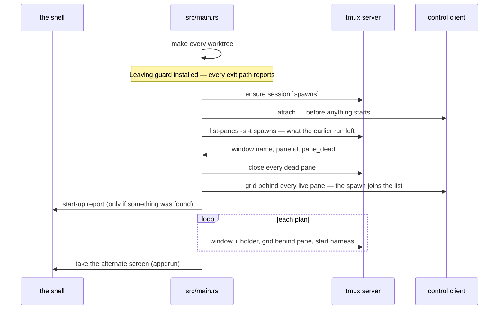

# Starting and leaving

How a run begins, in what order, what it takes over from the run before, and
what it reports at exit. The whole path is `src/main.rs`; the command line is
`src/cli.rs`; taking over an earlier run's spawns is `src/adoption.rs`; the
exit report is `src/litter.rs`. Litter is documented here:
[worktrees-and-branches.md](worktrees-and-branches.md) points back at this
document rather than repeating it. Vocabulary is the
[glossary](../glossary.md)'s.

## The three invocations

`cli::parse` reads the arguments and returns one of three invocations:

- **Bare** — `harness-launcher` with no arguments. Not a mistake: the app
  opens with nothing running and a draft in the slot. Everything the command
  line can say can also be entered in the form. See
  [drafts-and-creation.md](drafts-and-creation.md).
- **Spawns** — one group per spawn, groups separated by `--and`. Each group is
  a repository, a quoted description, and its own `--model`/`--level`. The
  separator exists so an unquoted description is refused rather than guessed
  at as a second spawn. A half-written group (`repository` and nothing else)
  is refused, never silently treated as bare.
- **`--help`** (or `-h`, in any group) — `cli::usage()`. The model and effort
  lists in the help text come from the harness seam (`harness::models()`,
  `harness::effort_levels()`), so the text cannot drift from what the app
  accepts. Only the sentence shapes are hardcoded.

Flag-by-flag detail is in the users' reference: [../../users/](../../users/)
and [../../../CHEATSHEET.md](../../../CHEATSHEET.md).

## The start-up order

Both spawning invocations run the same function, `spawn` in `src/main.rs`;
bare is `spawn(&[])`. The order, as the code has it:

1. **Check the harness is installed** — only when there is something to start.
   An app asked to start nothing has nothing to refuse over.
2. Read the slot's size, resolve the worktree root, name the tmux server on
   the app's socket. Nothing runs yet.
3. **Resolve every repository, then make every worktree.** All repositories
   resolve before any worktree is made, so a command naming four repositories,
   one of which is not one, refuses while nothing is on disk yet. A refusal
   part-way through `create` names what is already on disk.
4. **Install the `Leaving` guard.** From here the run has agents that outlive
   it, so every exit path — quitting, a refusal propagating up, a panic —
   reports what is left. The guard sits before the session, so a session that
   cannot be opened still gets a leaving report.
5. **Ensure the session, then attach the control client.** The client attaches
   before any harness starts, because a control-mode client streams only what
   is produced while it is attached: nothing may ever run unobserved. See
   [the-tmux-session.md](the-tmux-session.md).
6. **Adopt what the earlier run left running** (`adoption::adopt`), then
   report it. Adoption runs before this run's own spawns start, so the list
   reads in the order the spawns were made. The next section is the whole of
   it.
7. **Start the sessions** — per plan: window with the holder, grid behind the
   pane, then the harness (`creation::start`).
8. Start the [supervisor](concurrency.md); start a draft only when the list is
   empty; then `app::run` **takes the alternate screen** and draws until the
   user quits. See [the-screen.md](the-screen.md).



Refusals up to step 8 print on the shell the user is looking at, not on a
screen that closes behind them. `src/error.rs` turns each refusal into a
sentence, not a code; `main` prints it as `harness-launcher: <sentence>`.

## Adoption: what survives a close and reopen

Two decisions, and they are separate.

**On close the app kills nothing.** It sends no signal, runs no `kill-pane`
and cleans nothing up. An agent mid-turn does not stop because somebody closed
a viewer. This rule is older than everything below it, and nothing below
changes it.

**On start the app adopts.** It reads its own tmux session and puts what it
finds into the list, managed like any spawn it started itself. There is no
recovery prompt, no start-up surface and no per-item confirmation. The design
rule is that tmux and the filesystem are the source of truth and the app's
memory is a cache, so adoption is the app reading its own truth rather than
ignoring it.

`adoption::adopt` reads `Server::windows` — window name, pane id, `pane_dead`,
scoped to the session, with the `holding` window dropped — and does one of
three things with each window:

- **A dead pane is closed.** `remain-on-exit` keeps a pane after its process
  stops. There is nothing in one, and it shows up in every listing until
  somebody closes it. `Server::close` takes it away, and a close that fails is
  a line of the report rather than a refused start-up.
- **A live pane the app can describe joins the list.** A grid goes behind the
  pane, a `Watched` goes to the supervisor, and the spawn is in the list.
- **A live pane the app cannot describe is left running.** It is named in the
  start-up report with the reason, and nothing is done to it.

**A worktree is never removed here**, whether it is a leftover or an
apparently clean one. A worktree can hold committed work that was never merged
or changes that were never committed, and start-up is not where that is
decided. Leftovers are named in the report and left on disk. Removing a
worktree is [retirement](retirement.md)'s job, and only on the user's key.

### Rebuilding a spawn from the world

A spawn's name is its window name, its branch name and its worktree directory
name, so the name is the whole of what adoption needs to start from:

1. The worktree is `<root>/<name>`, joined onto the root. Nothing is created:
   adoption only reads.
2. The branch is `names::branch_name(name)`, the same call creation makes.
   Nothing is read: a worktree left on a detached HEAD carries a live agent
   all the same.
3. The repository is `git::worktree_repository`. It first checks that the
   directory is a worktree root of its own, because `rev-parse
   --show-toplevel` hands back the repository root for any other directory
   inside a repository. It then reads `worktree list --porcelain`, whose first
   entry is the main worktree. A submodule's first entry is its git directory,
   which resolves back to the submodule's working tree; a repository built
   with `--separate-git-dir` has no working tree at that entry, so it is
   refused.

Only the repository can fail, and failing means the app cannot say what the
spawn is working on. It refuses rather than guesses, which is a standing
design rule. The list groups rows by repository, so a guessed repository files
a row under the wrong heading. The spawn is left running and named in the
report.

**Model and effort do not come back**, and nothing on disk records them. That
was decided in tranche 1 §4.9 and is unchanged.

### An adopted spawn's screen starts blank

A control-mode client streams only what is produced while it is attached. A
spawn that drew its screen during an earlier run has nothing to replay, so its
grid starts with only what has arrived since.

The app shows the uncertainty instead of hiding it. `adoption::JOINED` is
written into the grid before anything else:

```
The app started after this spawn did.
This screen holds only what the spawn has drawn since.
```

A full-screen redraw by the spawn covers it. A spawn that only streams lines
leaves it on screen above them, and an idle agent redraws nothing at all. A
user selecting an adopted spawn therefore never reads a blank screen as an
agent that has produced nothing.

### The start-up report

`Adopted::found` writes it, and it is silent when an earlier run left nothing.
Everything is named, because the app remembers nothing between runs and a bare
count would leave the reader unable to find any of it:

```
harness-launcher: from an earlier run:
  taken into the list: add-retry-logic-a7f3, fix-the-flake-b2c9
  closed, because the spawn had already stopped: drop-the-cache-d4e1
  already stopped, and the pane would not close:
    stall-the-queue-e5f6: `tmux -L harness-launcher kill-pane -t %7` failed: can't find pane %7
  still running, and left out of the list because the app cannot say what they are:
    work-1a2b: …/work-1a2b is not the root of a worktree of its own, so git names no repository for it
  left on disk under /data/harness-launcher/worktrees: old-thing-9f2a
```

A pane that will not close is one line of the report, not a refused start-up:
the same rule as a spawn the app cannot describe.

The last line is every directory under the root that no spawn in the list
works in. This run's own worktrees are excluded by name, which is why the
report is written after the worktrees are made rather than before.

## Litter

- **What it is**: what the app leaves in the world when it exits or dies — the
  tmux session, worktrees, branches. Litter is accepted; invisible litter is
  not.
- **The survey**: `litter::surveyed` (`src/litter.rs`) is the only thing in
  the module that touches the world. It asks tmux which spawns the session is
  still running, nothing else. It makes no session, attaches nothing, and
  touches nothing on disk.
- **One report**: `litter::leaving` runs at exit and prints the session's
  name, how many spawns are still running, and the worktree root. The start-up
  report is `adoption::Adopted::found`, described above.
- **The next run adopts most of it.** Running spawns go into the list, dead
  panes are closed, and worktrees stay on disk. The walk-through is
  [../scenarios/litter-at-startup.md](../scenarios/litter-at-startup.md).

## Quitting

`F10` (`QUIT` in `src/app.rs`) leaves the draw loop and **kills nothing**: no
signal, no `kill-pane`, no cleanup. tmux outlives the app; the only act that
releases anything is [retirement](retirement.md). At exit the `Leaving` guard
runs `say_what_is_left`: a fresh survey, taken from the world rather than from
the app's own state, because by now they can disagree — a spawn may have
stopped on its own. The sentence claims only what quitting did ("quitting
stopped nothing"), and names the session and the worktree root. A failed
survey is reported, not swallowed: silence would read as "there was nothing to
leave".

## The reports print on the shell

Both reports go to the shell, where everything the app says before taking the
screen already goes. The start-up report prints just before the alternate
screen covers it, so in practice it is read at exit: the original screen comes
back when the app leaves, with the start-up report still on it and the leaving
report printed under it.

**Deliberately open**: whether the start-up report should instead be held back
until it can be read at start-up. The doc comment on `say_what_was_found` in
`src/main.rs` points at this document for that question, so this paragraph is
where it lives. That both reports print on the shell is not open; only the
timing of the start-up report is.
