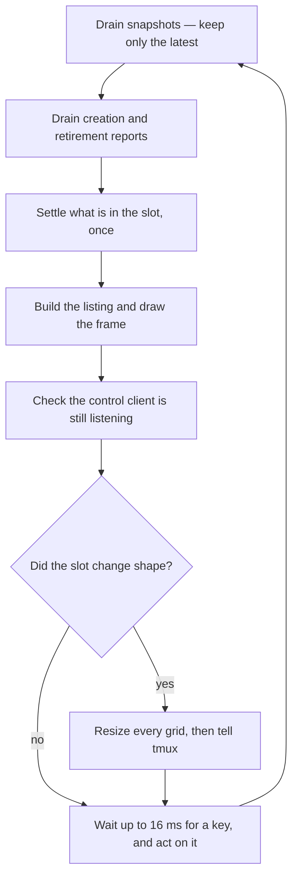

# The screen

The app draws the whole screen in one pass: list left, slot right, a separator
between them, a footer under the list. One renderer, so the halves cannot fall
out of line. Every dimension comes from the real terminal on every frame.
When the slot grows, the app tells tmux to grow the panes behind it.

Which file to open:

- `src/app.rs` — the layout, the frame loop, and the keyboard split.
- `src/list.rs` — the list: groups, headers, rows, marks, the band.
- `src/screen.rs` — one spawn's grid and its emulator.
- `src/scaffolding.rs` — the app's own drawing kit: marks, gutter, emphasis,
  and the column behaviour shared by list and form.
- `src/keys.rs` — turns a keystroke back into terminal bytes.

## The whole screen

```
SPAWNS                           │ ✻ Claude Code
                                 │
 +  faster harness startup       │ > fix the worktree cleanup so retiring a
                                 │   dirty spawn refuses instead of deleting
harness-launcher ●?··            │
▍●✻ fix-worktree-cleanup-dzec    │ ⏺ I'll start by reading how retirement
 ?✻ spawn-form-choices-cos1  1h4m│   is wired.
 ·✻ add-retry-logic-k81q       4m│
 ·✻ rate-limit-headers-s2lc   12m│     Read(src/retirement.rs)
                                 │     └─ 214 lines
acme-api ●··                     │
 ●✻ drop-legacy-auth-0c5f    2h1m│ ⏺ The check runs after the process
 ·✻ pagination-cursors-0fko    8m│   stops, which is right.
 ·✻ ssh-agent-forwarding-hnj5    │
                                 │ Shall I pass --untracked-files=all?
F2 starts a draft                │
F6 / F7 move the selection       │ ❯
F9 retires the spawn             │
F10 quits — nothing is killed    │
```

- The list takes a third of the width (`LIST_SHARE`), the separator one cell,
  the slot the rest (`regions` in `src/app.rs`).
- Right of the separator is the selected spawn's screen, copied cell by cell.
  The app draws nothing there except the band (below).
- On a real terminal the `▍` row is a painted band. The draft row is pinned
  above the repositories. A captured screen at twenty spawns is in
  `docs/evidence/scale-at-twenty.md` §3.
- The two twenty-five-character names show no age. Neither fits beside the
  column at this width, so each keeps the whole row for its name.

## One frame

The frame loop (`run` in `src/app.rs`), in order:



- Snapshots are drained, not queued: the frame shows only the current state.
  Creation and retirement reports are drained one by one; every line is a
  record.
- The slot's content is settled once, at the top of the frame, so the
  screen, the keyboard, and the target pane agree on one spawn or draft.
- On a resize the grids resize before tmux is told: the resize reaches the
  children as a redraw, and an old-shape grid would clip it.

## The list

- **Grouping.** Spawns group under the repository they were started against;
  repositories keep the order their first spawn arrived in. Within a group:
  stopped, unknown, working, then no status yet. The sort is stable; only a
  status change moves a row.
- **Drafts are pinned above every repository**, one row each. A draft has not
  chosen a repository yet. See [drafts-and-creation.md](drafts-and-creation.md).
- **The header carries a bar**: one mark per spawn, so `acme-api ●?··` reads
  at a glance. The name may take up to half the line; a bar out of room ends
  in `…`.
- **One line per entry, the selected one included.** A row is the gutter, the
  status mark, the harness glyph (`✻`, owned by
  [the-harness-seam.md](the-harness-seam.md); blank for a draft), a space,
  and the name. Branch and worktree derive from the name and are not shown.
  Overflow is cut with `…`, never wrapped.
- **The age is drawn at the right of a spawn's row**, right aligned in one
  column: `4m`, `31m`, `1h4m`. The widest age in the list sizes that column,
  once, so every row that shows an age cuts its name at the same place and the
  ages share a right edge. Which rows show one is decided per row: a row shows
  its age when its own name fits in full beside it. A row whose name would not
  fit drops its own age and keeps the whole width, and the rows beside it keep
  theirs. Names come first, and a name is cut only when it overruns the whole
  row on its own. Every age sizes the column, including the ages of rows that
  go on to drop them. That can leave the column a cell or two wider than the
  rows that use it need.
  A draft has no status, so it has no age, and its title takes the column's
  room. A spawn absent from the snapshot has no age either, and its name takes
  the same room. Neither is measured for the column, so a long title on such a
  row cannot take the ages off the rows beside it. The supervisor works the
  age out
  ([knowing-what-a-spawn-is-doing.md](knowing-what-a-spawn-is-doing.md)). The
  list writes it down and reads no clock.
- **The selection is held by name, never by position** (`Cursor`): rows
  re-order as statuses change, and a row number would land on a different
  spawn. Movement stops at the ends; no wrap.
- **The band.** The selected row is painted as a full-width band, gutter
  included: black on cyan normally, black on amber when the app is reporting
  a problem on that row. The row's own `AMBER` text is the report; it is not
  repeated.
- **The footer** lists what the keyboard does: four dim lines anchored to the
  bottom, all or none — a list shorter than eight rows drops all four. No
  mark legend.

## The marks

Shape and colour are one decision, made in `src/list.rs`: the status marks in
`shown_as`, the draft and retirement marks beside them. The selection mark
and the styles live in `src/scaffolding.rs`.

| Mark | Means | Reads as |
| --- | --- | --- |
| `·` | a working spawn | dark grey — it recedes |
| `●` | a stopped spawn | the user's own foreground, bold — the one bright thing |
| `?` | an unaccounted spawn | bold amber |
| `-` | a spawn being retired | dark grey |
| `+` | a draft being written | bold |
| `>` | a draft being made into a spawn | bold |
| `!` | a draft that could not be started, or a spawn that would not retire | bold amber |
| `▍` | the gutter of the row the keyboard is on | cyan — the band's style when the row is painted |

On one row, a retirement mark outranks a status mark. The statuses belong to
[knowing-what-a-spawn-is-doing.md](knowing-what-a-spawn-is-doing.md).

## The slot

- The slot holds exactly **one** thing: the selected spawn's grid or the
  selected draft's form. Moving the selection changes which, nothing else.
  Empty is ordinary at both ends of a run.
- **The band at the top of the slot** carries the app's sentences about the
  selected spawn: an unaccounted spawn's explanation (amber), and a
  retirement's sentence. The retirement comes last when both apply, being
  newer, and is amber only when it refused ([retirement.md](retirement.md)).
- The band is drawn **over the spawn's screen, not instead of it** (`explain`
  in `src/app.rs`): an unaccounted spawn is often still running. It covers
  the top because harnesses ask questions at the bottom, and releases its
  rows when the app has nothing left to say.
- The terminal's cursor is placed by whatever drew the slot — grid cursor or
  form caret — and hidden when the spawn hid it or the slot is empty.

## The grid

`src/screen.rs` is the emulator: bytes arrive from the control client per
pane, `Screen::apply` feeds them to a `vt100` parser, and the grid is drawn
cell by cell into the slot.

- **One grid per spawn, kept live whether or not it is on display.** The
  reader thread ([concurrency.md](concurrency.md)) fills every grid
  continuously, so switching selection is only a re-render: no pane moves,
  nothing resizes, nothing is notified.
- **No scrollback.** A grid is a screen, not a history: one spawn costs one
  screenful of cells. This stays coherent because the harness runs on the
  alternate screen, where the transcript never scrolls off the top.
- **Nothing is written back to the child from here.** tmux is the terminal
  the child is connected to and answers terminal queries itself; an answer
  from the app would arrive as keystrokes nobody typed. The transport belongs
  to [the-tmux-session.md](the-tmux-session.md).
- A spawn that named no colour inherits the user's terminal, as if started by
  hand.

## The keyboard

Seven function keys belong to the app (`what_it_means` in `src/app.rs`),
whatever the slot holds:

- F2 starts a draft.
- F3 discards one. It asks first; any key that is not the answer means *no*.
- F5 makes the draft in the slot into a spawn.
- F6 and F7 move the selection.
- F9 retires the spawn the list is on.
- F10 quits. Nothing is killed.

The path from F2 to a live session is
[../scenarios/from-keypress-to-running-harness.md](../scenarios/from-keypress-to-running-harness.md).
The user's view of the keys is `docs/users/` and
[../../../CHEATSHEET.md](../../../CHEATSHEET.md).

Every other key belongs to what the slot is holding:

- **A spawn**: `src/keys.rs` turns the key into the bytes a terminal would
  have sent — control chords, alt as an escape prefix, arrows in the form the
  spawn's screen requested (`Modes`, read off the grid) — and sends them to
  the spawn's pane through the control client.
- **A draft**: the key becomes an `Edit` (`edited` in `src/app.rs`), a table
  of meanings, and never leaves the app.
- **Nothing**: the key does nothing.

## Open questions this component owns

- **Scrolling past a screenful does not exist.** The list follows the
  selection just far enough to keep it on screen (`scroll_offset` in
  `src/scaffolding.rs`, whose doc points here). Reaching a row the selection
  is not on, in a column longer than the screen, is open.
- **The app does not implement mouse forwarding.** No mouse event is captured
  or forwarded to a spawn; the keyboard is the only input.
