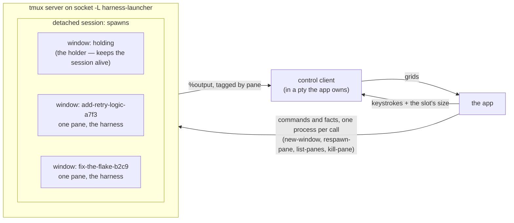

# The tmux session

The app uses tmux as a headless process supervisor, not as a display. Nothing
the user starts belongs to the app's process tree, so quitting the app kills
nothing. `tmux -L harness-launcher attach` shows what is still running after
the app exits. Commands are in `src/tmux.rs`; the output stream is in
`src/control.rs`.

## The shape

- One tmux server on a dedicated socket: every command carries
  `-L harness-launcher` (`Server::with_socket`). The user's own tmux server
  (the one `$TMUX` names) is never touched, so the app behaves the same
  inside or outside tmux.
- One detached session named `spawns` (`SESSION`), created with `-d`, never
  attached to a user's terminal. The name is public: the litter reports at
  startup and exit name it — see
  [starting-and-leaving.md](starting-and-leaving.md).
- One window per spawn, named after the spawn, one pane per window. Several
  spawns are several windows, never several sessions.
- One extra window named `holding` runs the holder. It only keeps the session
  alive before the first spawn and after the last one stops: tmux discards a
  session with no windows, which would also drop the control client's
  attachment. The reports filter it out (`running_in`).



## Two channels to tmux

1. **Per-command tmux calls** — create a window, start a program, list live
   panes, kill a pane. Each call runs one `tmux` process through
   `src/process.rs`. Arguments pass as a vector, one per element; no shell
   sees them. The `--` in `held` and `respawn_arguments` keeps the user's
   work as argv, not shell input.
2. **The control client** (`src/control.rs`). tmux streams every pane's
   output to the app through it; the app sends keystrokes and the slot's
   size back.

The split exists because control mode cannot report a process dying. Liveness
therefore uses per-command calls: the supervisor's tick is one `list-panes -a`
covering every pane on the server, so twenty spawns are twenty rows of one
listing ([knowing-what-a-spawn-is-doing.md](knowing-what-a-spawn-is-doing.md)).

## The control client

- One client attaches before anything starts (`Client::attach`) and carries
  every pane in the session, including windows not on screen. One reader
  thread serves all spawns; see [concurrency.md](concurrency.md).
- tmux refuses control mode on piped stdio (`tcgetattr failed`), so the app
  opens one pty and runs `tmux -CC attach` inside it. The children's ptys
  belong to tmux.
- Output arrives as `%output` notifications tagged with the producing pane.
  `Client::watch` registers a grid for a pane; `route` applies each
  notification to that grid. Grids are described in
  [the-screen.md](the-screen.md).
- The client streams only output produced while it is attached. A pane that
  drew before anyone listened stays blank forever.
- The app sends two things through the client: keystrokes (`Client::send`,
  bytes as hex so nothing needs quoting for tmux's parser) and the slot's
  size (`Client::resize`).
- Parsers on both channels are tested against recordings of real tmux
  output: `captured/tmux-control-mode.txt`, `captured/tmux-list-panes.txt`
  and others. `captured/README.md` describes how each was captured.

## The holder handshake

A spawn's window is created running the holder — `sh -c 'while :; do sleep
3600; done'`. The caller therefore has the pane's id, with a grid listening
behind it, before the harness writes its first byte. Only then does
`respawn-pane -k` replace the holder with the recipe. Reversing the middle
two steps would silently lose the first output.

```mermaid
sequenceDiagram
    participant App as the app
    participant Tmux as tmux server
    participant Client as control client
    App->>Tmux: new-window -d -n &lt;spawn&gt; -- &lt;holder&gt;
    Tmux-->>App: the pane's id
    App->>Client: watch(pane) — a grid, listening
    App->>Tmux: respawn-pane -k -t &lt;pane&gt; -c &lt;worktree&gt; -e … -- &lt;recipe&gt;
    Note over Tmux: the holder dies, the harness starts
    Tmux->>Client: %output &lt;pane&gt; …  (the first frame, not missed)
    Client->>App: applied to the grid
```

The recipe — program, arguments, environment, working directory — comes from
the harness seam. Nothing in `src/tmux.rs` knows what the program is. See
[the-harness-seam.md](the-harness-seam.md).

## tmux is the child's terminal

The harness's terminal is tmux, not the app. When a spawn asks where the
cursor is (`ESC [6n`), tmux answers before passing the bytes on. The app must
not answer too: a second reply would reach the harness as keystrokes nobody
typed. The app's emulator therefore has no write-back path, and an
integration test in `src/control.rs` checks this.

## Sizing

- A pane is created at the slot's dimensions: the session is made `-x`/`-y`
  the slot's size, and later windows inherit it, so the first frame has the
  right shape.
- When the app's window resizes, one `refresh-client -C` through the control
  client resizes every window in the session, including spawns off screen.
- Switching spawns resizes nothing: it re-renders a grid the app already
  holds. No pane moves; no `SIGWINCH` reaches a child.

## remain-on-exit and dead panes

`remain-on-exit` is set globally on the session. A pane whose command stops
is kept and reports `pane_dead` as `1` instead of vanishing, so the list can
say a spawn stopped rather than infer it from absence. Two costs follow:

- A dead pane sits on the server until retirement's `kill-pane` removes it.
- A dead pane's terminal is released and handed to the next pane that asks,
  so nothing may probe a pane by its tty once it is dead.

Handling of dead panes is in
[knowing-what-a-spawn-is-doing.md](knowing-what-a-spawn-is-doing.md) and
[../scenarios/a-dead-pane.md](../scenarios/a-dead-pane.md). Removal is in
[retirement.md](retirement.md).
