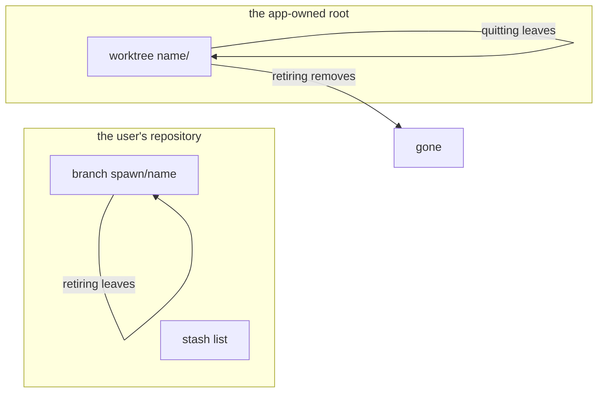

# Worktrees and branches

Where a spawn's checkout lives, how it is named, and what survives across
runs. Three files own it: `src/worktrees.rs` (the app-owned root),
`src/names.rs` (naming), and `src/git.rs` (every git command the app runs).

## The app-owned root

- Every worktree lives under **`$XDG_DATA_HOME/harness-launcher/worktrees`**,
  falling back to `~/.local/share/harness-launcher/worktrees` when
  `$XDG_DATA_HOME` is unset or empty. If neither resolves, the app refuses:
  there is nowhere to put worktrees (`worktrees::root`).
- **The root sits outside every repository.** Inside one, worktrees would show
  as untracked files in the user's own `git status`, and the only fix would be
  editing *their* `.gitignore` — writing into a project the app does not own.
  A root the app owns also makes leftovers findable.
- **The root is deliberately not configurable.** Accepted cost: the worktrees
  are not where a git-literate user would first look.
- The app resolves the root once, before taking the screen, and creates it
  lazily (`worktrees::prepare`) when the first spawn needs it. The worktree's
  own directory is left for `git worktree add` to create: git refuses a path
  that already exists, and that refusal is kept.
- At start-up the app names every directory under the root that no spawn in
  the list works in, and leaves it there. It removes no worktree at start-up.
  That report belongs to [starting and leaving](starting-and-leaving.md); the
  walk-through is [litter at startup](../scenarios/litter-at-startup.md).
- Adoption reads a worktree to work out which repository an earlier run's
  spawn belongs to: `git::worktree_repository`. It only reads, and it creates
  no directory.

## Naming

- **One string names the spawn, its branch and its worktree directory**, so
  things left on disk identify themselves: spawn `add-retry-logic-a7f3`,
  branch `spawn/add-retry-logic-a7f3`, directory
  `<root>/add-retry-logic-a7f3` (`spawn_name` and `branch_name` in
  `src/names.rs`).
- The readable half is a **slug of the work description**: lowercased, whole
  words only, up to 32 characters, `work` when nothing usable survives.
  Branches outlive spawns and get read months later while pruning:
  `spawn/a7f3` is unreadable by then, `spawn/add-retry-logic-a7f3` is not.
- The unique half is a **four-character random suffix**, seeded from the
  clock, the process id, and an atomic count of seeds handed out. The count
  distinguishes two spawns started in the same instant, which a coarse clock
  would name identically.
- **A path is never reused**, because the suffix is random rather than a
  counter. Worktree metadata stranded by a crash — which git does not reap for
  months — therefore never blocks anything.

## Creation

- **Always `git worktree add -b`, never the bare form.** A safety rule, not a
  style rule: without `-b`, git silently checks out a *pre-existing* branch of
  that name instead of creating one, dropping a fresh agent onto somebody's
  in-progress work (`git::add_worktree`).
- **Always `--no-track`.** The flag enforces two rules:
  - A spawn's branch starts *from* the default branch and is not a second copy
    of it. With tracking, `git status` in the worktree would report the work
    as up to date with `origin/main`, and `git pull` there would merge main
    into it.
  - Tracking makes git write upstream configuration into the repository's own
    `.git/config`. That file's lock was the one thing two spawns created at
    once really did contend for. Not writing it lets creation run with no lock
    at all ([drafts and creation](drafts-and-creation.md),
    [concurrency](concurrency.md)).

## The base

- A spawn branches from the repository's **default branch, resolved locally
  from `refs/remotes/origin/HEAD`** (`git::default_branch`). **No fetch**:
  spawning stays off the network. A stale local default is the state of the
  repository, exactly as if the user had branched by hand.
- **A spawn never continues from the branch the user is standing on.** Stacked
  work is arranged by hand.
- Each unresolvable case is a refusal, not a guess, and each names its fix:
  - no commits yet — nothing to branch from;
  - a detached `HEAD` — check out a branch first;
  - no `origin` remote — the default cannot be resolved;
  - `origin/HEAD` not recorded — run `git remote set-head origin --auto`.
- There is no fallback because choosing between `main` and `master` picks
  wrong in a repository that has both, and a wrong base means an agent works
  from the wrong code for an hour.

## Shelling out

Everything in `src/git.rs` shells out to `git` itself — a decision, not a
shortcut. libgit2, which nearly every language binds, has no worktree-remove
at all, and its prune deletes the directory with no cleanliness check.
Shelling out means one tool, git's own semantics, and one definition of
"clean" (`git::uncommitted`, flags and all), which belongs to
[retirement](retirement.md).

## What survives what

- **Quitting the app leaves everything**: the session, the worktrees, the
  branches. Litter is accepted, never invisible; it is reported at start-up
  and at exit ([starting and leaving](starting-and-leaving.md)).
- **Retiring removes the worktree and keeps the branch**
  ([retirement](retirement.md)). Ignored files go with the worktree. A stash
  made in one lives in the repository's stash list and survives.
- **A branch is the durable product of a spawn.** It sits on the user's
  repository, under a name that says what the work was, holding whatever the
  agent committed. Deleting a branch is the user's act, taken with git, not
  the app's.

Vocabulary as defined in [the glossary](../glossary.md).
