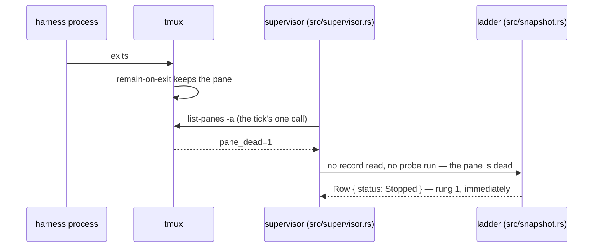

# A dead pane

A harness process ends inside its pane: it finishes, exits with an error, or
dies. The pane stays, the app knows within a tick, and one trap around dead
panes is respected everywhere. The pieces are
[the tmux session](../components/the-tmux-session.md) and
[knowing what a spawn is doing](../components/knowing-what-a-spawn-is-doing.md).

## The sequence

1. **The harness process** exits, for any reason.
2. **tmux** keeps the pane instead of reaping it, because the session is
   created with `remain-on-exit` on (`src/tmux.rs`, `Server::session`). From
   then on `list-panes` reports the pane with `pane_dead` as `1`. Without this
   setting a stopped spawn would simply be absent, a different fact reported
   differently.
3. **The supervisor** (`src/supervisor.rs`) reads this on the next tick, in
   the same single `list-panes -a` that covers every spawn. It reads no record
   and runs no probe for a dead pane. `alive_in` (`src/snapshot.rs`) decides
   which panes get evidence; the tick and the ladder share that one function,
   so they cannot disagree.
4. **The ladder** (`src/snapshot.rs`, `climb`) answers at rung 1: a pane that
   stopped and was kept means **stopped**, immediately. This signal cannot go
   stale, and rung 1 needs no other check. The harness's record and the
   spawn's age do not matter: the grace period covers a record not yet
   written, never a dead pane.
5. **The list** shows `●` on the row, and the spawn sorts first in its group.
   Stopped is the status that might need the user.
6. **The grid** keeps the last screen the process drew. The control client
   received everything up to the exit; nothing more arrives, and nothing needs
   to. It is a screen, not a history, left as the harness drew it.



```
 harness-launcher ●·
▍● add-retry-logic-a7f3    │⏺ Done. The retry logic is in place and
 · fix-the-flake-b2c9      │  the tests pass. Anything else?
```

## The trap the code respects

tmux releases a dead pane's terminal and hands it to the next pane that asks.
The captured listing shows this happening (`captured/README.md`): the dead pane
`%2` reports `/dev/pts/3`, the same terminal the live pane `%3` now holds. So
**nothing may probe a dead pane by its terminal**: a `ps` against that tty
would report some other spawn's process as if it were this one's.

The code never does this. Death resolves at rung 1, before any probe is
considered, and the supervisor gathers evidence (record and tie-breaker alike)
only for panes `alive_in` reports as running something. The `Pane` type
records the same rule: its `tty` is only valid while the pane is alive
(`src/tmux.rs`).

## Retiring it

Retiring a dead-pane spawn follows the same strict order as any other: stop,
confirm gone, check clean, remove. Stopping something already gone is cheap:
`running_in` (`src/retirement.rs`) filters out dead panes, finds nothing to
signal, and moves straight to the dirty check. Nothing to signal is not a
special case; most retirements are in this state, because the user usually
retires a spawn after watching it finish.

The retirement's own `kill-pane` removes the pane from the server last. Until
then the pane appears in every `list-panes`; that is the price of
`remain-on-exit`. See
[a-retirement-that-refuses.md](a-retirement-that-refuses.md) for the order in
full.

A dead pane the user never retires outlives the run. The next start-up closes
it and names it in the start-up report, and leaves its worktree on disk. See
[starting and leaving](../components/starting-and-leaving.md).
