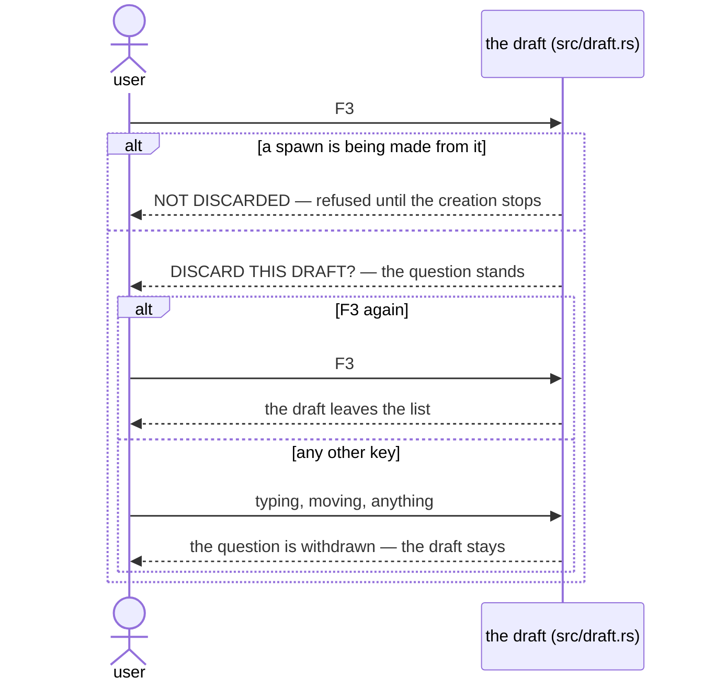

# A draft discarded mid-creation

`F3` is the only key that asks a confirmation question, and a draft a spawn
is being made from is the only draft that refuses to be discarded. This page
covers both, and what discarding does. Vocabulary is defined in
[the glossary](../glossary.md); the component view is in
[drafts and creation](../components/drafts-and-creation.md).

## The sequence

1. **First press: the question.** `F3` on a draft calls `Drafts::discarded`
   (`src/draft.rs`); the first press sets `Discarding::Asked` and the draft
   stays. The form shows `DISCARD THIS DRAFT?` in amber: the typed words
   exist nowhere else, and no worktree, branch, or session would be lost with
   them. The footer says: *F3 again discards it; typing or moving away keeps
   it.*
2. **Any other key answers no.** One key means yes; every other key means no
   (`takes_the_question_back` in `src/app.rs`): moving, starting, retiring,
   and typing at a session all withdraw every standing question. A key aimed
   at the form is consumed by the draft (`Draft::edited`); it is spent on the
   answer and never lands in the text, so answering no never inserts a
   character. A key the app has no meaning for, such as `Esc` or `F1`, leaves
   the question standing.
3. **Second press: the answer.** A second `F3` removes the draft. The
   selection moves only if it was on the removed row, onto the first
   remaining row (`Held::discard` in `src/app.rs`).

## The one refusal

A draft a spawn is being made from refuses (`Draft::discarded`, the
`starting()` arm): the creation runs on its own thread and cannot be
cancelled, and the row is the only thing on screen naming the worktree being
made. Discarding it would leave both the worktree and its record lost.

The form shows `NOT DISCARDED` and the reason. A refusal is a notice, not a
question, so the next key clears it and takes its normal effect. Once the
creation stops — made or refused — the draft can be discarded again
(`Draft::failed` clears any refusal it was carrying).

## After a failed creation

A creation that stopped after making something changes what the question
says, not whether it is asked. `Draft::made_something` counts any step at
all: each record line was written before its step ran, so a possible creation
counts as a real one. The question then also serves as the announcement: the
typed words are removed, but anything the record says was made stays on disk,
and nothing in this run mentions it again.

The record names the worktree and the branch, and the form keeps both visible
while the question stands. Discarding is their last mention until the app
next starts and reports what it finds under the worktree root
([starting and leaving](../components/starting-and-leaving.md)). The app
accepts litter, but never invisible litter — see
[a creation that fails halfway](a-creation-that-fails-halfway.md).

## What discarding actually does

Discarding removes a record from a list; nothing else happens anywhere.
`Drafts::discarded` removes the draft from the `Vec`. `Held::discard` in
`src/app.rs` touches no server, no client, no channel, and no thread: a
draft owns no worktree, branch, or process, so there is nothing outside the
app to notify and nothing to shut down.

This is the whole asymmetry with [retirement](../components/retirement.md),
visible in the function signature. The draft's identity is never reused, even
by a draft that replaces a discarded one.
