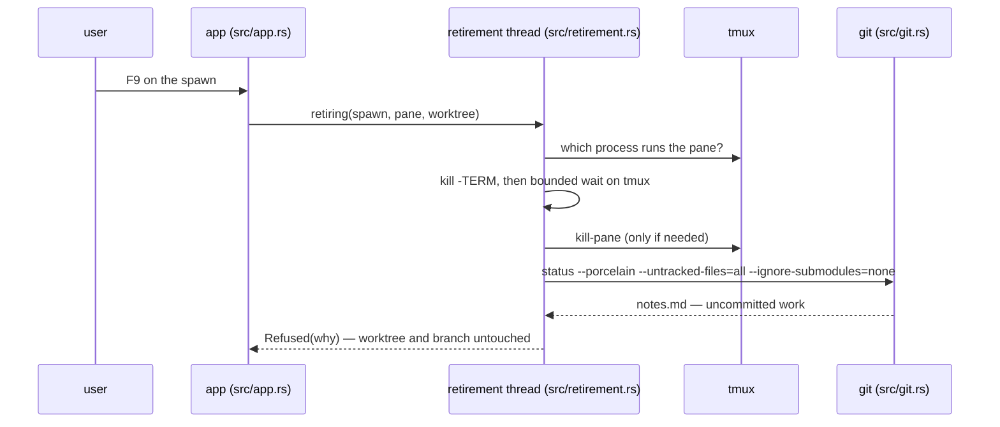

# A retirement that refuses

The user presses `F9` on a spawn whose worktree holds uncommitted work. The
retirement stops the session, runs the dirty check, and refuses. The app will
not choose between somebody's work and their instruction. The machinery is
[retirement](../components/retirement.md); the display is
[the screen](../components/the-screen.md).

## The sequence

1. **The app** (`src/app.rs`, `Held::retire`) takes the spawn the list is on
   and records `Retirement::Doing` against it (`Retirements::asked_for`); a
   second press while one is under way does nothing. The app runs the work on
   its own thread (`retirement::retiring`), so every other spawn keeps
   drawing.
2. **The retirement thread** (`src/retirement.rs`, `retire`) reports *stopping
   the session*, then asks tmux which process the pane is running.
3. **The retirement thread** sends that process `SIGTERM`, so the harness can
   shut down cleanly. It waits up to three seconds (`PATIENCE`), polling tmux
   every 25ms. tmux decides when the process is gone, not the return value of
   `kill`: a pane tmux reports dead is a process tmux has reaped.
4. **The retirement thread** kills if it has to: `kill-pane` as the backstop,
   then up to two more seconds (`CLOSING`) confirming both pane and process
   are gone (`kill -0` — the one direct pid check, because after `kill-pane`
   there is no pane left to ask). A session that outlives even this produces a
   refusal with nothing removed.
5. **The retirement thread** reports *checking the worktree for work that is
   not committed* and runs the dirty check (`git::uncommitted`, `src/git.rs`) —
   exactly:

   ```
   git -C <worktree> status --porcelain --untracked-files=all --ignore-submodules=none
   ```

   The flags matter: the user's `status.showUntrackedFiles` and submodule
   settings must not decide what the app may delete. Stopping first makes the
   check reliable; a check against a live agent races the files the agent
   writes on exit.
6. **The retirement thread** finds output and refuses. The worktree and the
   branch are left untouched. The refusal names up to three of the files
   (`named`, `NAMED`) so the user can recognise the work.
7. **The app** records `Retirement::Refused` on the spawn, which stays where
   it was, still listed.



## What the user sees

While the retirement runs, the row shows the mark `-`, in grey. On refusal it
turns `!`, in amber, the colour the app uses for admissions (`src/list.rs`).
Selecting the row puts the sentence in the slot's band (`said_about` in
`src/app.rs`):

```
▍! add-retry-logic-a7f3  │/data/…/worktrees/add-retry-logic-a7f3 has work in it
                         │that is not committed (?? notes.md) — deal with it and
                         │retire the spawn again. The session has been stopped
```

When the app also cannot account for the spawn, both messages write in the
band, and the retirement goes last: it is the newest event, and what the user
who pressed the key came back to read. A retirement under way writes in plain
heading, not amber. Only the refusal is an admission, so only the refusal
takes the amber.

## The accepted cost

The refusal comes **after** the kill, so a dirty spawn ends up stopped and
must be dealt with by hand. This is deliberate: a check before stopping would
give a second answer about cleanliness, and the answer that decides anything
would still be the one taken after the stop.

So: go to the worktree, commit or discard what is in it, and press `F9` again.
A refused retirement can be asked for again (`Retirements::asked_for`), and
stopping a session that has already exited costs nothing (see
[a-dead-pane.md](a-dead-pane.md)). The worktree survives the refusal; the
branch survives even a completed retirement.
