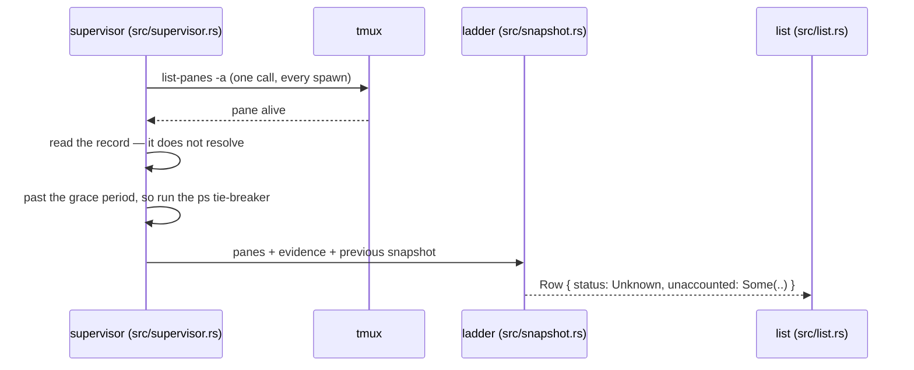

# An unaccounted spawn

A spawn's pane is alive, but the app cannot say what the agent in it is doing.
The status is `unknown`. The machinery is
[knowing what a spawn is doing](../components/knowing-what-a-spawn-is-doing.md);
the display is [the screen](../components/the-screen.md).

## How it becomes unknown

Every tick, the supervisor (`src/supervisor.rs`) gathers evidence and hands it
to the status ladder (`src/snapshot.rs`), which checks its four rungs per
watched spawn:

1. **The supervisor** lists every pane in one `tmux list-panes -a`. The
   spawn's pane is alive, which alone settles no status; rung 1 decides
   nothing.
2. **The supervisor** stats the harness's status record for the pane's process
   and reads it only when it has changed. Here the record does not resolve
   (`Records::of`): an older harness, a configuration directory somewhere
   else, a changed format, or no record location at all.
3. **The ladder** checks the grace period (`past_grace`, eight seconds from
   adoption — `GRACE`). Inside it the spawn shows *working* without evidence.
   This spawn is past it.
4. **The supervisor** runs the tie-breaker, because the record failed and the
   grace period is over: `ps` against the pane's terminal, asking which
   process holds it (`foreground`). The answer is cached for five seconds
   (`AN_ANSWER_LASTS`) instead of being asked five times a second.
5. **The ladder** reads the tie-breaker (`climb`). The tie-breaker can only
   change the answer to *stopped*, never to *working*. Here the harness still
   holds the terminal, or the probe failed. A failed probe must never read as
   the agent being gone, so the ladder decides nothing.
6. **No check produced an answer**, so the ladder returns rung 4:
   `Status::Unknown`, with an `Unaccounted` on the row carrying the reason,
   the pane, the process, and the last status the app managed to read.



## What the user sees

The row shows the mark `?`, in amber (`shown_as` in `src/list.rs`), and the
spawn sorts above the working ones: a tooling problem should be visible.
Selecting the row puts the full account in the slot's band (`said_about` and
`explain` in `src/app.rs`). The band is painted over the **top** of the
spawn's screen, which stays live underneath, because the spawn is often still
running.

```
 SPAWNS                  │the app cannot tell what add-retry-logic-a7f3 is doing.
 harness-launcher ?·     │its pane %3 is alive, running process 14634.
▍? add-retry-logic-a7f3  │what went wrong: its session record carries no status
 · fix-the-flake-b2c9    │the last status it could read was working.
                         │⏺ the spawn's own screen, still drawing …
```

The four sentences come from `Unaccounted::explained` (`src/snapshot.rs`). If
the app has never read a status, the band says so; the grace period's
*working* is assumed, not read, and is never quoted back. The pane and process
ids are what `tmux list-panes` and `ps` are asked about next, because a reader
of this band is diagnosing the app.

## Why it clears

Only an `unknown` row carries an `Unaccounted`. When a later tick reads a
record that resolves, or the tie-breaker finds another process holding the
terminal (*stopped*), the ladder builds a row with a real status and no
`Unaccounted`. The next snapshot replaces the last, the mark changes, and the
band clears. Nothing is remembered against the spawn except the last status
the app could read.

## What unknown does not mean

`unknown` says nothing about the agent, and it is not a kind of *stopped*.
*Stopped* means go and look at the spawn. *Unknown* means something is wrong
with the tooling: the harness moved its records, `ps` is not on `PATH`, the
app's handle on the pane is wrong. The agent may be mid-turn.

So do not touch the work. Open the spawn, read the band, and check the tool
it names (the record, the probe, or the pane) using the pane and process id
from the band.
