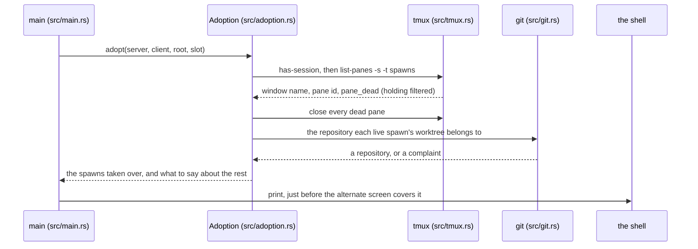

# Litter at startup

The app starts and finds leftovers from a previous run: the old tmux session
still alive with spawns running in it, and worktrees under the app-owned root.
That is litter. The app adopts what it can describe, closes the panes whose
spawns have already stopped, and names the rest. It removes no worktree. The
pieces are [starting and leaving](../components/starting-and-leaving.md) and
[worktrees and branches](../components/worktrees-and-branches.md).

## The sequence

1. **main** (`src/main.rs`, `spawn`) resolves the slot, the worktree root and
   the app's tmux server — every step that can fail while output still goes to
   the shell. It makes this run's own worktrees, opens the session, and
   attaches the control client.
2. **Adoption** (`src/adoption.rs`, `adopt`) runs next, before this run's own
   spawns start. It asks tmux what the session holds.
3. **tmux** (`src/tmux.rs`, `Server::windows`) runs `has-session` first, then
   `list-panes -s -t spawns`, reading window name, pane id and `pane_dead` per
   pane. `main` opened the session two steps earlier, so here `has-session`
   always answers yes; it earns its place in the exit report, which runs on a
   machine that may have no session at all. The `holding` window is the app's
   own furniture and is filtered out.
4. **Adoption** handles each window in turn, with the three outcomes
   [starting and leaving](../components/starting-and-leaving.md) decides: a
   dead pane is closed, a live pane the app can describe joins the list, and a
   live pane it cannot describe is left running. What a spawn is described
   from is that document's *Rebuilding a spawn from the world*.
5. **Adoption** (`Adopted::found`) writes the report: what was taken, what was
   closed, what would not close, what is still running outside the list, and
   which worktrees under the root no spawn in the list works in. With nothing
   in any of them, no report is written.
6. **main** prints the report to the shell, starts this run's own spawns, and
   runs with the adopted spawns already in the list.

## The report

A sample of it is in
[starting and leaving](../components/starting-and-leaving.md), which owns the
report's shape. Everything is named. The app remembers nothing between runs,
so a bare count would leave the reader unable to find any of it.

The report is printed to the shell a moment before the alternate screen covers
it. In practice the user reads it at exit, when the original screen returns
with the report still on it and the leaving report printed under it. This
placement is an accepted cost; whether the report should instead be held back
so it can be read at start-up is an open question recorded in
[starting and leaving](../components/starting-and-leaving.md). That both
reports go to the shell is settled: the shell is where everything the app says
before taking the screen already goes.

## What the app does not do to it

- **It never removes a worktree.** Leftovers are named and left on disk. The
  reasoning is in
  [starting and leaving](../components/starting-and-leaving.md), which owns
  the rule.
- **It never stops a spawn.** A spawn it cannot describe keeps running,
  because it is still an agent doing work.
- **It never asks.** There is no recovery prompt and no per-item confirmation.
  Adoption is the app reading its own source of truth, not a feature with a
  surface.

## What is left for the user

- **Attach to the session** with `tmux -L harness-launcher attach -t spawns`
  to reach a spawn the app left out of the list.
- **Deal with a leftover worktree** the usual git way. A spawn, its branch and
  its worktree all carry the same name, which is what makes the report usable.
- **Ignore it.** The report exists so that ignoring a leftover is a decision,
  not an accident.
