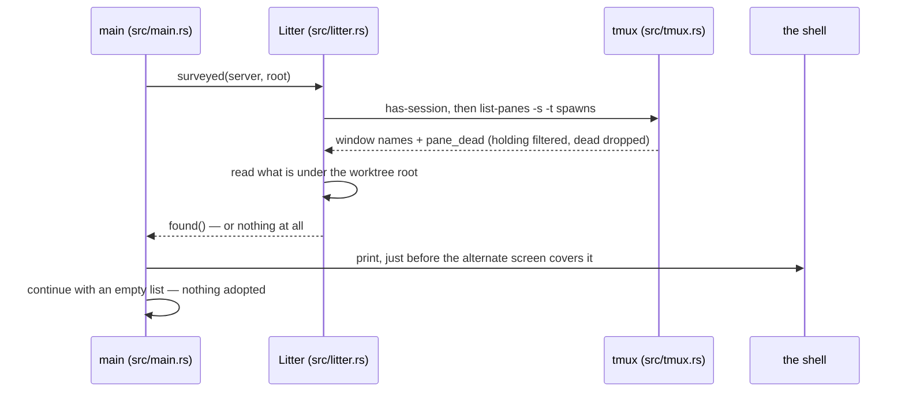

# Litter at startup

The app starts and finds leftovers from a previous run: the old tmux session
still alive with spawns running in it, and worktrees under the app-owned root.
That is litter. Litter is accepted, but never invisible: the app reports it,
adopts nothing, and carries on. The pieces are
[starting and leaving](../components/starting-and-leaving.md) and
[worktrees and branches](../components/worktrees-and-branches.md).

## The sequence

1. **main** (`src/main.rs`, `spawn`) resolves the slot, the worktree root and
   the app's tmux server — every step that can fail while output still goes to
   the shell. Before creating anything, it surveys the world
   (`say_what_was_found`). The order matters: a moment later this run's own
   worktrees exist, and a survey taken then would report them as leftovers.
2. **Litter** (`src/litter.rs`, `Litter::surveyed`) takes the one look; it is
   the only function in the module that touches anything. It asks tmux what is
   running and reads what is under the worktree root, nothing else: no session
   made, no pane opened, nothing attached, nothing on disk touched.
3. **tmux** (`src/tmux.rs`, `Server::running`) runs `has-session` first, so
   the survey does not itself create the session it reports on; then
   `list-panes -s -t spawns`, reading window name and `pane_dead` per pane.
   The `holding` window is the app's own furniture and is filtered out. A
   dead pane is a spawn that has stopped, not one still running.
4. **Litter** (`found`) writes the report. It names everything, because the
   app has just started and remembers nothing; a bare count would give the
   reader no way to find the items. If nothing is found, no report is written:
   an empty session is the app's own furniture, not litter.
5. **main** prints the report to the shell and continues as if nothing had
   been found: plans, session, client, supervisor, an **empty list**. Nothing
   is adopted, restored or recovered. The report is a statement about the
   world, not a feature.



## The report

```
harness-launcher: found from an earlier run, and left alone:
  2 spawns are still running in the tmux session `spawns`: add-retry-logic-a7f3, fix-the-flake-b2c9
  3 worktrees under /data/harness-launcher/worktrees: add-retry-logic-a7f3, fix-the-flake-b2c9, work-1a2b
none of it is adopted — this run starts with an empty list, and anything above is yours to deal with.
```

The last line states that nothing is adopted, because a list of running
agents at start-up naturally reads as agents the app has picked up. It has
not, and the list beside it is about to be empty.

The report is printed to the shell a moment before the alternate screen
covers it. In practice the user reads it at exit, when the original screen
returns with the report still on it and the leaving report printed under it.
This placement is an accepted cost; whether the report should instead be held
back so it can be read at start-up is an open question recorded in
[starting and leaving](../components/starting-and-leaving.md). That both
reports go to the shell is settled: the shell is where everything the app
says before taking the screen already goes.

## What to do with it

Three options, none of them the app's:

- **Attach to the old session** with
  `tmux -L harness-launcher attach -t spawns` and deal with the agents
  directly. The session belongs to the previous run and outlived it on
  purpose, because quitting kills nothing.
- **Retire things by hand**: stop what is running, then remove worktrees the
  usual git way. A spawn, its branch and its worktree all carry the same name,
  which is what makes the report usable.
- **Ignore it.** The report exists so that ignoring litter is a decision, not
  an accident.
